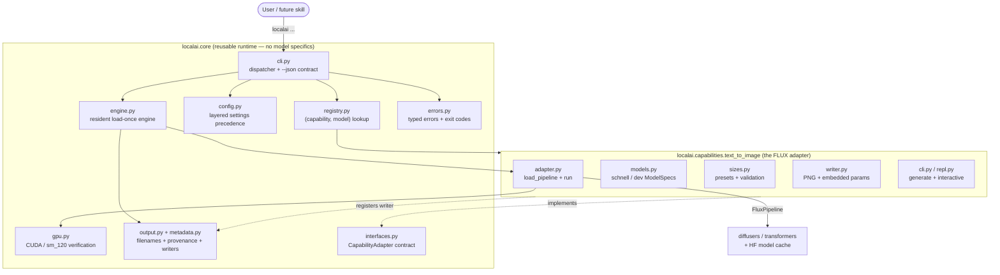
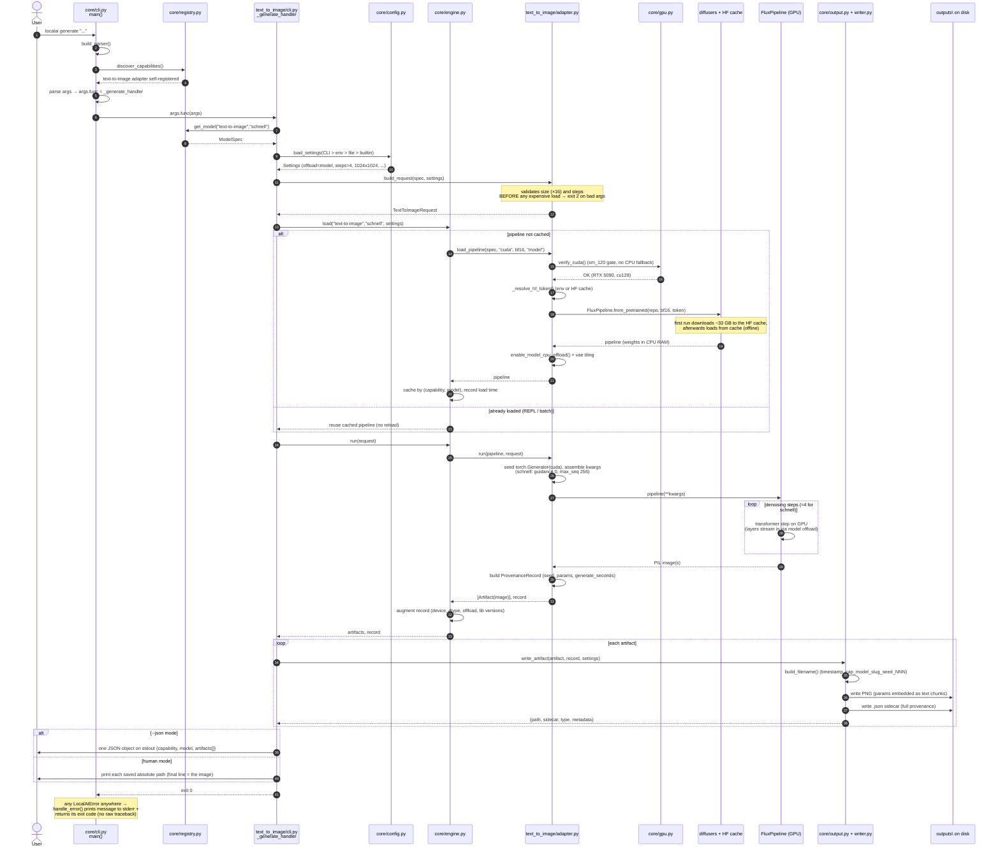

# High-Level Architecture

How LocalAIExecution is built, structured, and what happens end-to-end when you
run a command. For the on-disk layout (in-repo **and** the external model cache),
see [`FilesAndModelsStructure.md`](FilesAndModelsStructure.md).

---

## 1. The big idea: a core + pluggable adapters

The project is a **local-AI execution platform**, not just an image generator.
It separates *what is true for every model* (the **core/runtime**) from *what is
specific to one model family* (a **capability adapter**).

- **Core** (`localai.core`) — modality-agnostic. It knows nothing about FLUX,
  images, prompts, or steps. It knows about GPUs, a registry, layered config, a
  load-once engine, provenance, output files, errors, and the CLI.
- **Capability adapter** (`localai.capabilities.text_to_image`) — holds *all*
  FLUX-specific behavior behind one small interface.

Adding a future model (another image model, or audio/language later) is a **new
adapter module + one import line** — with **no changes to the core**. This is the
central design constraint.



---

## 2. Module responsibilities

| Module | Responsibility |
|--------|----------------|
| `core/cli.py` | Builds the top-level `localai` parser, registers core commands (`doctor`, `capabilities`), asks each adapter to contribute its subcommands, dispatches, and renders the shared `--json` result. Catches all errors → `handle_error`. |
| `core/interfaces.py` | The `CapabilityAdapter` protocol + `Artifact` / `InferenceRequest` base types. The only contract the core depends on. |
| `core/registry.py` | Holds capabilities and their `ModelSpec`s keyed by `(capability_id, model_id)`. `discover_capabilities()` imports the manifest so adapters self-register. |
| `core/config.py` | Resolves effective `Settings` with strict precedence (see §5). Type-coerces and validates values. |
| `core/engine.py` | The resident engine: selects device/dtype, **loads a pipeline once** and caches it by `(capability, model)`, routes `run`, and `unload`s to free VRAM. Wraps low-level failures (OOM) in typed errors and augments the provenance record with runtime fields. |
| `core/gpu.py` | `detect_nvidia_gpu()` (parses `nvidia-smi`), `verify_cuda()` (CUDA available + device + **sm_120 in torch's arch list**), a tiny on-device smoke, and the `doctor` report. The make-or-break Blackwell gate. |
| `core/metadata.py` | `ProvenanceRecord` — capability/model/repo, seed, timings, device/dtype/offload, library versions, and a capability-specific `params` block. Serializes to the sidecar JSON. |
| `core/output.py` | `register_writer(type, fn, ext)`, collision-safe `build_filename(...)`, and `write_artifact(...)` (selects the writer, writes the payload + `.json` sidecar). |
| `core/errors.py` | The exception hierarchy with stable exit codes + `handle_error()`. |
| `text_to_image/models.py` | The two `ModelSpec`s: `schnell` (default, ~4 steps, guidance 0) and `dev` (gated, ~28 steps, guidance ~3.5). |
| `text_to_image/adapter.py` | `load_pipeline` (build the FLUX pipeline on cuda/bf16 + offload) and `run` (seeded generator, schnell/dev-aware kwargs, timing, provenance). Maps HF/diffusers failures → typed errors. |
| `text_to_image/sizes.py` | Aspect presets + multiple-of-16 validation. |
| `text_to_image/writer.py` | The concrete `image` writer (PNG with provenance embedded as text chunks). |
| `text_to_image/cli.py` | The `generate` (one-shot) and `interactive` subcommands + arg→settings mapping. |
| `text_to_image/repl.py` | The resident REPL: load once, per-prompt overrides, `/set` `/model` `/show` commands, model switching with VRAM hygiene. |

---

## 3. The adapter contract

Every capability implements this small interface (`core/interfaces.py`). The
core is written against **only** this surface:

```python
class CapabilityAdapter(Protocol):
    capability_id: str
    display_name: str
    def list_models(self) -> list[ModelSpec]: ...
    def register_cli(self, subparsers, shared_parents) -> None: ...
    def build_request(self, model_spec, settings) -> InferenceRequest: ...
    def load_pipeline(self, model_spec, device, dtype, offload): ...
    def run(self, pipeline, request) -> tuple[list[Artifact], ProvenanceRecord]: ...
```

Self-registration happens on import: `text_to_image/adapter.py` ends with
`register_capability(TextToImageAdapter())`, and `capabilities/__init__.py`
imports the module. That single import line is the entire "plug-in" step.

---

## 4. End-to-end flow: `localai generate "a serene mountain lake at dawn"`

This is the full path from process start to the saved PNG + printed path.



### Interactive mode differs in one way
`localai interactive` runs the **load** step once, then loops the **run → write**
steps per prompt with the cached pipeline (no reload). `/model dev` calls
`engine.unload(...)` to free VRAM before loading the new pipeline, and restores
the previous model if the switch fails.

---

## 5. Configuration precedence

`load_settings(...)` merges layers; later layers win:

```
CLI args  >  env vars (LOCALAI_*)  >  config file
    ( [text-to-image.models.schnell] > [text-to-image] > [defaults] )
  >  built-in defaults ( model-spec > capability(offload=model) > core )
```

Example: `--steps 8` beats `LOCALAI_STEPS=6` beats a `localai.toml` value beats
the schnell default of `4`.

---

## 6. Errors & exit codes

Expected failures raise a typed `LocalAIError` subclass; `core/cli.main` catches
everything and renders an actionable message to **stderr** (never a raw
traceback), returning a deterministic code:

| 0 | 1 | 2 | 3 | 4 | 5 | 6 | 7 | 8 |
|---|---|---|---|---|---|---|---|---|
| ok | unexpected | invalid args | CUDA/torch wrong build | GPU absent | OOM | gated/token | network/download | unknown capability/model |

These codes are part of the stable contract a skill relies on
(see [`skill-invocation.md`](skill-invocation.md)).

---

## 7. Why these choices

- **Core/adapter split** → new models don't touch tested core code.
- **Resident engine** → load the ~33 GB model once (~5 s from cache), then
  generate in ~10 s; the REPL and batch reuse one pipeline.
- **GPU gate first** → `verify_cuda()` refuses to silently run on CPU on the
  Blackwell sm_120 card; the cu128 wheel is mandatory.
- **Provenance everywhere** → every image is reproducible and self-describing
  (seed + settings in the PNG and the sidecar).
- **`--json` contract** → a future skill calls one command and reads one object.
